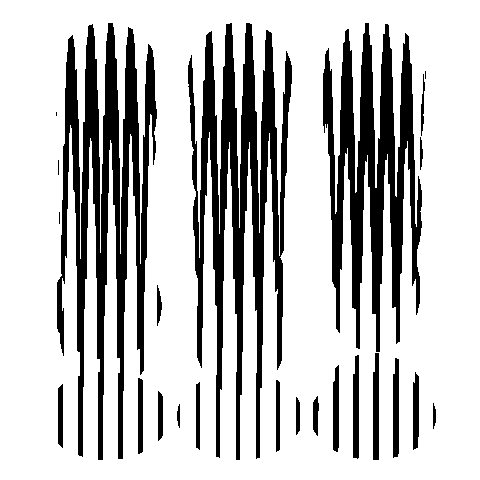
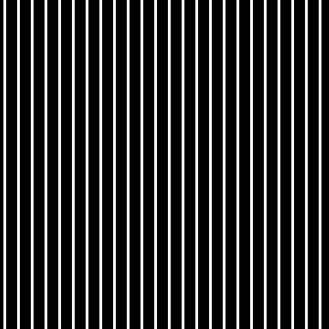

# Generate Moire Patterns

This script generates/calculate moire patterns from animated GIFs.

The inputs GIFs are in the `input` directory and the output is generated in the `output` directory.
The main output is 2 static PNG images: `moire-front.png` and `moire-back.png`

Example of how to use the 2 PNG images using HTML and CSS: https://codepen.io/usernameisuser/pen/qBGNEZx

You can also print it out on paper and a transparent sheet to make a physical copy.

## Samples

Back side (print on normal white A4 sheet)

Front side (print this on a transparent sheet of plastic)

## Reference

https://en.wikipedia.org/wiki/Moir%C3%A9_pattern

https://youtu.be/0NbjqkLay7Q
